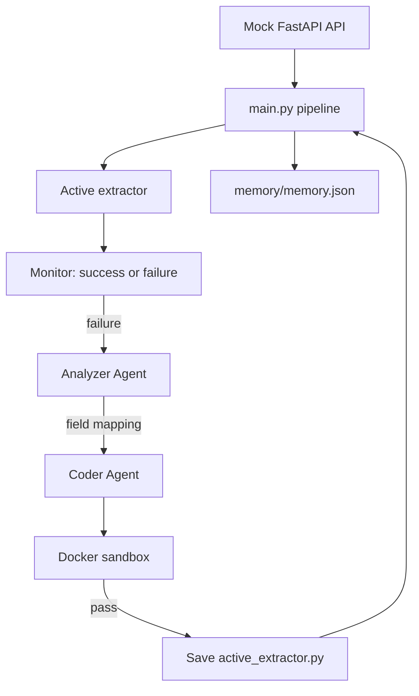

# Autonomous Self-Healing Data Pipeline

A small learning prototype showing how a pipeline can recover when a third-party API changes its JSON shape.

This is intentionally not a production-grade autonomous system. The code favors readable functions and a deterministic offline fallback over complex frameworks.

## Problem

The original extractor expects:

```json
{"name": "Rohit", "age": 22, "city": "Bangalore"}
```

The third-party API later returns:

```json
{"user": {"full_name": "Rohit", "details": {"age": 22, "location": "Bangalore"}}}
```

The internal pipeline output stays the same in both cases: `name`, `age`, and `city`.

## Architecture



## Files

- `mock_api/main.py`: returns API V1 or V2 from `/users?version=1|2`.
- `extractor/active_extractor.py`: extractor currently used by the pipeline.
- `agents/analyzer.py`: asks an LLM for a dot-path mapping, or uses the local mapping fallback.
- `agents/coder.py`: asks an LLM for `extract(data)` code, or generates simple code locally.
- `sandbox/runner.py`: writes generated code and test JSON to a temporary folder and runs them in Docker.
- `memory_store.py`: reads and writes the one JSON memory file.
- `main.py`: runs the complete demonstration.

## Setup

Open PowerShell in this folder:

```powershell
python -m venv .venv
.\.venv\Scripts\Activate.ps1
python -m pip install -r requirements.txt
Copy-Item .env.example .env
```

Docker Desktop must be installed and running. The first sandbox run may download `python:3.13-slim`.

The LLM is optional. Without `LLM_API_KEY`, the program uses a small local fallback so the demo remains understandable and runnable. For Gemini, edit `.env`:

```text
LLM_PROVIDER=gemini
LLM_API_KEY=your-key
LLM_MODEL=gemini-2.5-flash
```

This project is configured for Gemini only; set `LLM_API_KEY` and `LLM_MODEL` in `.env` and the code will use the Gemini endpoint automatically.

## Run

Terminal 1, start the mock API:

```powershell
uvicorn mock_api.main:app --reload
```

Terminal 2, run the demonstration:

```powershell
python main.py
```

You can inspect the two API versions directly at:

- `http://127.0.0.1:8000/users?version=1`
- `http://127.0.0.1:8000/users?version=2`

The pipeline first tests V1, then sends V2 to the old extractor. The resulting `KeyError` is the simple monitor signal. The Analyzer returns a mapping, the Coder makes a deliberately invalid attempt and then a corrected attempt, and the Docker sandbox decides whether each attempt passes. Only the passing code is deployed.

## Example output

```text
[API] V1 response: {'name': 'Rohit', 'age': 22, 'city': 'Bangalore'}
[MONITOR] Extraction successful
[MONITOR] Extraction failed - schema changed (KeyError: 'name')
[ANALYZER] Mapping discovered: {"name": "user.full_name", "age": "user.details.age", "city": "user.details.location"}
[CODER] Testing an intentionally bad first attempt
[SANDBOX] Bad attempt rejected: ...
[CODER] Generating corrected extractor
[SANDBOX] Corrected extractor passed: {'name': 'Rohit', 'age': 22, 'city': 'Bangalore'}
[DEPLOY] New extractor is now active
[MONITOR] Extraction successful after self-healing
```

## Memory and deployment

`memory/memory.json` stores the last generated code, mapping, success flag, and error. That record is passed into the next Coder prompt. The passing code replaces `extractor/active_extractor.py`; failed code never replaces it.

Because deployment is persistent, after a successful run the active extractor understands V2. To replay the original V1-to-V2 story, replace `extractor/active_extractor.py` with the initial V1 version shown in that file, or restore the repository copy before running again.
